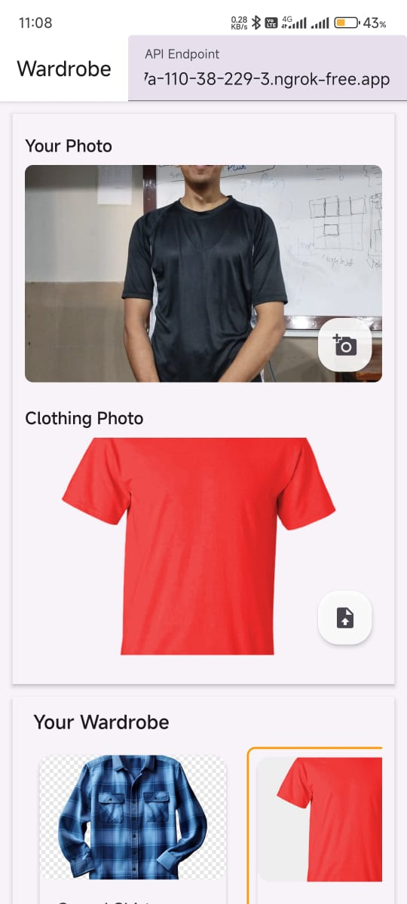
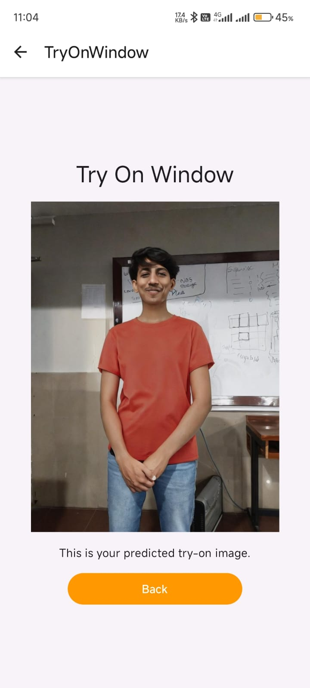
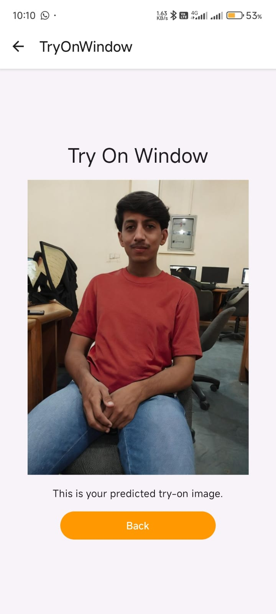

# Style Snap: A Virtual Wardrobe Experience 👗✨

**A culturally inclusive virtual try-on app for traditional Pakistani and Eastern attire**

<p align="center">
  
</p>

[](https://expo.dev)
[](https://reactnative.dev)
[](LICENSE)

---

## 🌟 Overview

**Style Snap** is a mobile-first virtual try-on app powered by React Native and Expo, designed specifically for traditional Pakistani and Eastern clothing. The app uses an AI backend (based on StableVITON) for inference, offering users a seamless and culturally inclusive virtual try-on experience.

<p align="center">
  
  
  
</p>

---

## 📱 Features

- 🧕 **Culturally Focused**: Tailored for Eastern attire such as kurtas, shalwar kameez, and lawn suits
- 🎯 **Virtual Try-On**: Upload your photo and preview garments in real-time
- 💡 **User-Friendly UI**: Clean interface with filtering by style, color, and region
- 🔄 **Expo-based App**: Cross-platform support via React Native & Expo
- 🤖 **AI-Powered Backend**: Hosted via Docker for inference

---

## 🧩 Tech Stack

- **Frontend**: React Native, Expo
- **Backend**: StableVITON (Dockerized for inference)
  - Inference Image: [`bazooka101/stableviton-app`](https://hub.docker.com/r/bazooka101/stableviton-app)
  - Training Image: [`bazooka101/stable_viton`](https://hub.docker.com/r/bazooka101/stable_viton)
- **AI Models**: Custom fine-tuned StableVITON for Eastern garments
- **Languages**: TypeScript, Python
- **Cloud/DevOps**: Docker, GitHub, AWS (optional)

---

## 🚀 Running the App

### 🔧 Prerequisites

- [Node.js](https://nodejs.org/)
- [Expo CLI](https://docs.expo.dev/get-started/installation/)
- A working backend (see Docker images above)

### 📲 Steps

1. Clone the repository:

   ```bash
   git clone https://github.com/ahmedmst2423/StableVITONApp.git
   cd StableVITONApp
   ```

2. Install dependencies:

   ```bash
   npm install
   ```

3. Start the Expo development server:

   ```bash
   npx expo start
   ```

4. Use the Expo Go app on your phone to scan the QR code and launch the app.

---

## 📦 Inference Server Setup

To use the AI backend, run the Docker container locally or on a server:

```bash
docker pull bazooka101/stableviton-app
docker run -p 8000:8000 bazooka101/stableviton-app
```

Make sure the app's API URL points to this backend.

---

## 🎨 Dataset

Used for training the AI backend:

- **Sources**: Limelight, Mohagni, MTJ, Junaid Jamshed
- **Categories**: Kurtas, dresses, casual wear, traditional lawns
- **Focus**: Pose diversity, cultural authenticity, high-res inputs

---

## 📊 Model Performance

| Metric              | Value | Description             |
| ------------------- | ----- | ----------------------- |
| **FID Score**       | 8.50  | Overall image quality   |
| **CLIP Similarity** | 0.88  | Semantic fidelity       |
| **DensePose IoU**   | 0.82  | Body alignment accuracy |
| **Parsing mIoU**    | 0.78  | Segmentation quality    |
| **Keypoint Error**  | 4.2px | Pose preservation       |

---

## 🧠 Architecture

The system consists of:

1. **Segmentation Module**: Generates agnostic person images and garment masks
2. **Cross-Attention Warper**: Aligns garments to target poses using latent-space warping
3. **Diffusion Generator**: Synthesizes final images with attention to realism

---

## 🤝 For Service Providers

Coming soon — a portal for:

- **Garment Uploads** with metadata tagging
- **Try-On Analytics** to track usage and engagement
- **Category Management** for filtering by style, color, and region
- **Insights Dashboard** for performance tracking

---

## ⚠️ Known Issues

- Residual texture blending on highly patterned fabrics
- Ghosting effects under poor lighting conditions
- Mobile-side performance reliant on backend server availability

---

## 🛣️ Future Roadmap

- 📱 Mobile-native inference with TensorFlow Lite or Core ML
- 📊 Service provider analytics portal
- 🧵 Texture fusion improvements
- 🧬 Dataset expansion for regional diversity
- 🕶️ AR Try-On integration

---

## 👥 Team

- **Ahmed Mustafa** (21K-3370) – Lead Developer
- **Anwer Saeed** (21K-3303) – AI/ML Engineer
- **Shayan Anwar** (21K-4836) – Data Engineer

**Supervisor**: Muhammad Nouman Durrani – FAST School of Computing, NUCES Karachi

---

## 📄 Citation

```bibtex
@misc{stylesnap2025,
  title={Style Snap: A Virtual Wardrobe Experience for Traditional Eastern Attire},
  author={Ahmed Mustafa and Anwer Saeed and Shayan Anwar},
  year={2025},
  institution={FAST School of Computing, NUCES Karachi}
}
```

---

## 🙏 Acknowledgments

- StableVITON team for foundational work
- FAST School of Computing, NUCES Karachi
- Pakistani clothing brands for dataset access
- Open-source developers for enabling tools and libraries

---

**Made with ❤️ to preserve and modernize cultural fashion**
